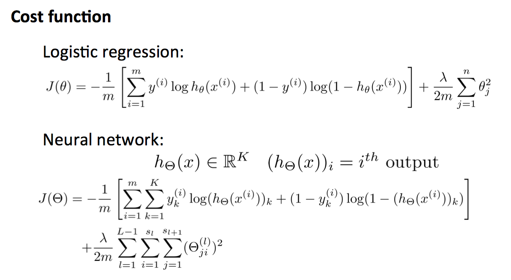
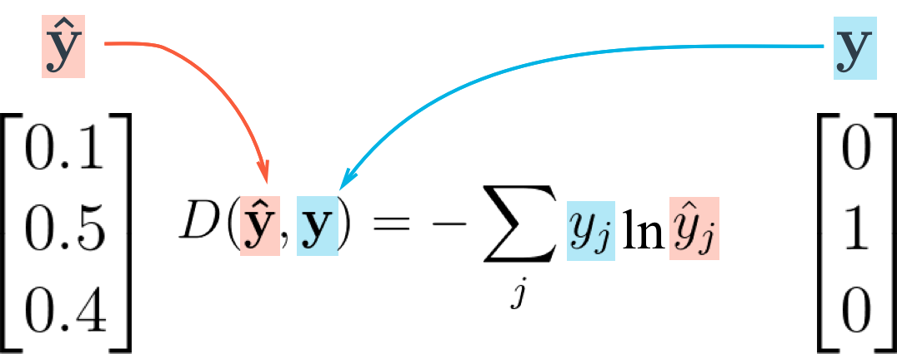
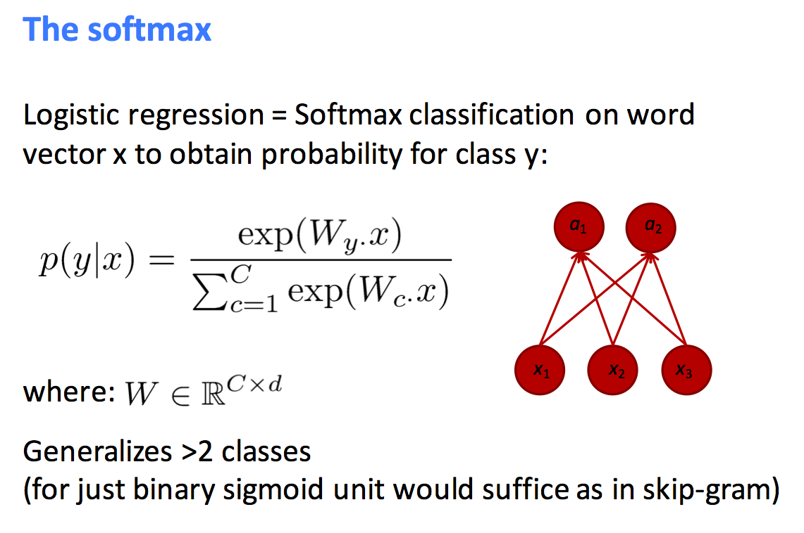
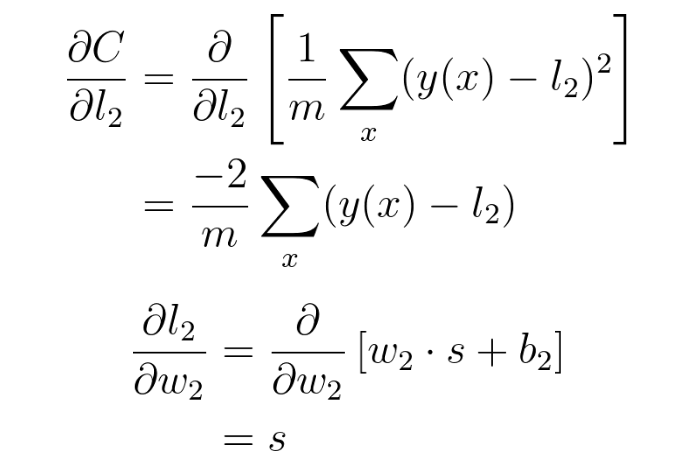
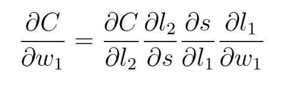

# learn_NeuralNet

Neural network的本质是寻找input和output的相关性，传统上，相关性指的就是线性相关性，但Neural network可以找到非线性相关，这正是Neural network的强大之处。

前面几层的activation function一般用logistic function来计算，最后一层可以用logistic function来计算概率（没有归一化的概率，一类一类来看，哪一类的概率最大就预测是哪一类），也可以用softmax function来计算概率（归一化的概率，统一来看，哪一类的概率最大就预测是哪一类）。

各层的activation function的选择其实比较灵活，不一定非要用非线性函数，也可以简单就用$f(x)=x$这样的activation function。在两种情况下往往会用到linear layer:
* 模型的输出是连续值，在这种情况下，output layer会使用linear layer
* 模型在很大程度上用作input的feature detector，也就是，用input到hidden layer的weights组成一个高维向量来表示对应的input. 在这种情况下，hidden layer往往是用linear layer，而不用nonlinear layer.

相比其他的机器学习模型，neural network在增强信噪比方面要强得多，所以，如果用neural network的话，有时候可以不去做feature selection，让neural network在训练过程中自己选择feature. 但是，这并不意味着信噪比对neural network不重要，如果可以人工减小信噪比的话，neural network训练的速度和准确度都会大大提升。减小输入的信噪比在任何的数学建模中都非常重要，否则就是garbage in garbage out.

Neural net在众多的建模问题中非常管用，是一种新的建模技术（或者说，在大数据时代，被重新发现的建模技术），但是，依然有它主要适用的场景，比如图像、语言、自然语言理解、围棋等，并不意味着任何一个数学建模问题都应该用Neural net来解决。当前进展迅速的是Neural net能解决的数学建模问题，而不是所有的数学建模问题，因此，在学习时，要学习Neural net能解决的数学建模类型，而不是把所有的靠谱的、不靠谱的数学建模都学个遍。

## 1. Cost function and logistic regression

Logistic regression和neural network的cost function除了用上面的形式外，其实也可以用最简单的mean squared error，实际值就是0或者1，预测值就是所得到的0到1的概率。

对于二分类问题，cost function用上面的形式，在做back propagation时，与output是连续函数并用$f(x)=x$来做activaton时的结果是一样的。（对于forward pass用sigmoid function做activation的二分类问题，一般用上面的函数来做cost function，但是对于forward pass用softmax function做activation的多分类问题，需要引入cross entropy等cost function.）

对于二分类问题，如果用$f(x)=x$来做activaton，结果为正一个类，结果为负是另一个类，其实也是可以用MSE来做cost function的，结果也与上面的cost function用作二分类的结果一样，只是在实际上，没必要这么做，就用上面的cost function就好了。

Previously we've been using the sum of squared errors as the cost function in our networks, but in those cases we only have singular (scalar) output values. When you're using softmax, however, your output is a vector. We want our error to be proportional to how far apart these vectors (the label vectors and the prediction vectors) are. To calculate this distance, we'll use the cross entropy. Then, our goal when training the network is to make our prediction vectors as close as possible to the label vectors by minimizing the cross entropy. The cross entropy calculation is shown below:

What's cool about using one-hot encoding for the label vector is that yj is 0 except for the one true class. Then, all terms in that sum except for where yj=1 are zero and the cross entropy is simply D=−ln
y^ for the true label. For example, if your input image is of the digit 4 and it's labeled 4, then only the output of the unit corresponding to 4 matters in the cross entropy cost.

## 2. Forward propagtion, cost function and softmax regression

矩阵乘法的本质是对一个或多个向量进行线性变换（旋转和伸缩）。如果是列向量，多个线性变化的计算顺序是从右向左的。如果是行向量，多个线性变换的计算顺序是从左向右的，也就是numpy和tensorflow所使用的顺序。多个行向量同样组成一个矩阵。

[神经网络中数学知识简易梳理](https://zhuanlan.zhihu.com/p/27664917)

矩阵的特征向量表征了这个线性变换的旋转的方向，特征值表征了这个线性变换的伸缩的大小。

当使用softmax regression作forward propagation时，最后一个layer是使用softmax function来计算，如果是k个分类，最后一层就有k个neuron，每个neuron的值就是exp（hx），然后将k个neuron的值进行归一化处理（除以k个neuron值的加和），k个neuron的值就变成了是每个分类的概率（k个概率的和为1）。最后，概率最大的那个neuron对应的分类作为预测的分类。

The softmax function squashes the outputs of each unit to be between 0 and 1, just like a sigmoid. It also divides each output such that the total sum of the outputs is equal to 1. The output of the softmax function is equivalent to a categorical probability distribution, it tells you the probability that any of the classes are true.

The only real difference between this and a normal sigmoid is that the softmax normalizes the outputs so that they sum to one. In both cases you can put in a vector and get out a vector where the outputs are a vector of the same size, but all the values are squashed between 0 and 1. You would use a sigmoid with one output unit for binary classification. But if you’re doing multinomial classification, you’d want to use multiple output units (one for each class) and the softmax activation on the output.

The softmax function squashes it's inputs, typically called logits or logit scores, to be between 0 and 1 and also normalizes the outputs such that they all sum to 1. This means the output of the softmax function is equivalent to a categorical probability distribution. It's the perfect function to use as the output activation for a network predicting multiple classes.

当使用softmax regression作拟合时，所使用的cost function一般用cross entropy cost function (it is called cross entropy error or cross entropy cost)，对于softmax function算出的k个neuron的概率值，只有实际分类对应的那个neuron上的概率值会被保留，然后log求和。比如，总共有5个分类，某个实际分类y1i = 列向量[1, 0, 0, 0, 0]，k个neuron的概率值的向量y2i = 列向量[p1, p2, p3, p4, p5]，两个向量的内积（点乘）或者y1i转置后叉乘logy2i，得到一个值yi，最终的cost function就是把m个样本的yi加起来，最后取负值（相反数）。

C个feature，每个feature的维度是d（对于图像识别，是C个分类，d个像素点）。W.x是线性函数的矩阵形式。

## 3. Wholly (fully) linked neural network

此处使用的neural network是wholly linked neural network，没有额外的assumption，完全根据数据来拟合系数参数，是理论上最正确的一种neural network，但因为所需数据较多，计算量较大，实用价值较小。

## 4. Back propagation

Back propagation的本质就是微积分中的求偏导，求出偏导来，就能用gradient descent的方法来更新weights，一步步逼近最优解. 对于每个weight，都要求偏导。Cost相对于每个weight的偏导，可以通过chain rule来推导。

最终的output的error是预测值（对真实值）的偏离，但这种偏离不只是由最后一层neuron造成的，而是由多层neuron累积而成的，所以，每一层neuron都存在其预测值的偏离，而这种预测值的偏离误差是可以用后一层的预测值的偏离误差计算出来的，计算公式就是back propagation的公式，这个公式在数学上是可以证明的。

在计算back propagation时，最重要的搞清楚error和error term的算法。对于output layer, error就是实际值减去预测值，error term等于error乘以output layer的activation function derivative. 对于hidden layer, error可以由后一层的error term与两层之间的weights的矩阵乘法得到，error term同样等于error乘以hidden layer的activation function derivative. Gradient descent过程中weights的变化值，可以由前一层的输出值与后一层的error term之间的矩阵乘法得到（其实就是先求乘积后加和）。

Now we can see a clear pattern. To find the gradient, you just multiply the gradients for all nodes in front of it going backwards from the cost. This is the idea behind backpropagation. The gradients are passed backwards through the network and used with gradient descent to update the weights and biases. If a node has multiple outgoing nodes, you just sum up the gradients from each node.

This is what a gradient means, it's a slope, how much you change the cost ∂C given a change in the weight. So a node with a larger gradient with respect to the cost is going to contribute a larger change to the cost. In this way, we can assign blame for the cost to each node. The larger the gradient for a node, the more blame it gets for the final cost. And the more blame a node has, the more we'll update it in the gradient descent step.

Back propagation其实是根据反馈不管调整weights的过程，一般来说，要一组一组样本来做。得到的weights的变化值的维度与weights的维度完全相同。一组一组样本来做时，经常用到zip函数，zip可以把两个list转换成tuple形式，用在循环中。

forward propagation: calculate the prediction function; forward pass, calculate output from input; related - activation function, prediction function

back propagation: calculate the gradient for gradient descent of loss function; back pass, calculate error term of layers from output error; related - error term, error function, loss function, cost function, objective function

## 5. Function and strength

neural network的强大之处在于，多个线性boundary的结合可以模拟任何复杂的非线性的boundary，所以通过多层多个neuron的设置，可以用neural network逼近任何复杂的函数，模拟该函数。

线性规划的意义和neural network的意义是类似的，虽然实际情况是非线性的，但在线性规划中，通过设置多条直线的boundary，可以模拟非线性情况，所以，线性规划在运筹学中的应用才能如此广泛。

## 6. Neural net用于连续值的建模

Neural net不只可以用于分类（无序类或有序类），也可以用于连续值的预测。

传统上，连续值的建模只是使用简单的linear regresssion. 实际上，可以使用neural net来抓住问题中的非线性特征，在最后一层output中，可以使用$f(x)=x$这个简单的activation function（之前各层的activation function仍然使用常用的sigmoid function），就可以得到连续的预测值，而且预测值的范围可以从无穷小到无穷大，不再局限于（0，1）。

## 7. Dummy variable and one-hot encoding

### (1). dummy variable
The rank feature is categorical, the numbers don't encode any sort of relative values. Rank 2 is not twice as much as rank 1, rank 3 is not 1.5 more than rank 2. Instead, we need to use dummy variables to encode rank, splitting the data into four new columns encoded with ones or zeros. Rows with rank 1 have one in the rank 1 dummy column, and zeros in all other columns. Rows with rank 2 have one in the rank 2 dummy column, and zeros in all other columns. And so on.

Pandas中有一个很好的函数get_dummies（pd.get_dummies），可以很方面的把categorical data转换成dummy variable. 之后也是使用pandas中的两个函数，concat用来把新的dummy variable连接在data frame中，drop用来去掉已经转换过的原来的列。

在处理完dummy variable之后，模型中除了连续的变量以外，就只剩0和1的数值了。对于dummy variable的某一列，在样本中要至少出现几百次才有意义，如果只出现几十次，这个dummy variable都没有存在的意义，可以直接drop.

如果data frame中有除连续数值和0、1之外的其他值，比如一些字符串，可以写一个get_target_for_label()函数，函数的argument是字符串，return的结果是0或者1. 调用该函数就可以把字符串label转换为0和1.

### (2).one-hot encoding
Transforming your labels into one-hot encoded vectors is pretty simple with scikit-learn using LabelBinarizer. 

## 8. Requirements of gradient decent

A step function is the starkest form of a binary output, which is great, but step functions are not continuous and not differentiable, which is very bad. Differentiation is what makes gradient descent possible.

### (1). Input data

We'll also need to standardize the GRE and GPA data, which means to scale the values such they have zero mean and a standard deviation of 1 (For normal distribution, 68% data are within the range of one standard deviation). This is necessary because the sigmoid function squashes really small and really large inputs. The gradient of really small and large inputs is zero, which means that the gradient descent step will go to zero too. Since the GRE and GPA values are fairly large, we have to be really careful about how we initialize the weights or the gradient descent steps will die off and the network won't train. Instead, if we standardize the data, we can initialize the weights easily and everyone is happy.

对于pandas的data frame中的列series来讲，可以用mean()和std()来直接作用于series求相应的值。

实际上，即使我们不是把sigmoid function用作activation function, 我们也要对数据做normalization，因为我们不想让数据太大，也不想让数据太小，太大的数据与太小的数据相加，在数值计算中很容易出问题。

Data normalization之后(各个方向上的数据都比较均衡)，该gradient descent的过程中，optimizer也能更快的达到minimal point.

在normalize的过程中，也不一定除以标准差，除以范围（数据的最大值-最小值）也是不错的选择。

### (2). weights

First, you'll need to initialize the weights. We want these to be small such that the input to the sigmoid is in the linear region near 0 and not squashed at the high and low ends. It's also important to initialize them randomly so that they all have different starting values and diverge, breaking symmetry. So, we'll initialize the weights from a normal distribution centered at 0. A good value for the scale is 1/√n，where n is the number of input units. This keeps the input to the sigmoid low for increasing numbers of input units.

### (3). learning rate

To make learning rate between 0.01 and 0.1 (也可能是0.1到1), we use Mean Square Error instead of Sum Square Error. 在实际建模过程中，learning rate是从大往小试，如果使用的是Mean Square Error，一般从1开始试起。

如果learning rate太大的话，training accuracy有可能始终很大，因为步长太长，导致在gradient descent的过程中没法取到minimal的值。这时候要减小learning rate.

在stochastic gradient descent中，可以在进行过程中让learning rate越来越小，比如exponential decay.

You might be tempted to set a really big learning rate, so the network learns really fast, right?

Be careful! If the value is too large you could overshoot the target and eventually diverge. 

### (4). activation function and vanishing gradient

The maximum derivative of the sigmoid function is 0.25, so the errors in the output layer get reduced by at least 75%, and errors in the hidden layer are scaled down by at least 93.75%! You can see that if you have a lot of layers, using a sigmoid activation function will quickly reduce the weight steps to tiny values in layers near the input. This is known as the vanishing gradient problem. Later in the course you'll learn about other activation functions that perform better in this regard and are more commonly used in modern network architectures.

The derivative of the sigmoid maxes out at 0.25 (see above). This means when you're performing backpropagation with sigmoid units, the errors going back into the network will be shrunk by at least 75% at every layer. For layers close to the input layer, the weight updates will be tiny if you have a lot of layers and those weights will take a really long time to train. Due to this, sigmoids have fallen out of favor as activations on hidden units.

Instead of sigmoids, most recent deep learning networks use rectified linear units (ReLUs) for the hidden layers. A rectified linear unit has output 0 if the input is less than 0, and raw output otherwise. That is, if the input is greater than 0, the output is equal to the input.

ReLU activations are the simplest non-linear activation function you can use. When the input is positive, the derivative is 1, so there isn't the vanishing effect you see on backpropagated errors from sigmoids. Research has shown that ReLUs result in much faster training for large networks. Most frameworks like TensorFlow and TFLearn make it simple to use ReLUs on the the hidden layers, so you won't need to implement them yourself.

It's possible that a large gradient can set the weights such that a ReLU unit will always be 0. These "dead" units will always be 0 and a lot of computation will be wasted in training.

From Andrej Karpathy's CS231n course:
>Unfortunately, ReLU units can be fragile during training and can “die”. For example, a large gradient flowing through a ReLU neuron could cause the weights to update in such a way that the neuron will never activate on any datapoint again. If this happens, then the gradient flowing through the unit will forever be zero from that point on. That is, the ReLU units can irreversibly die during training since they can get knocked off the data manifold. For example, you may find that as much as 40% of your network can be “dead” (i.e. neurons that never activate across the entire training dataset) if the learning rate is set too high. With a proper setting of the learning rate this is less frequently an issue.

用ReLU做activation时，其实有很多node是被筛选掉的，如果input的值是正负各一半，weights的值也是正负各一半的话，理论上，大概有一半的input node在最终的模型中是没有用的，进入到下一层，输入是正值，weights的值是随机正负各一半的话，这一层又有一半的node因为输出是负值而变得没用，这样的话，其实也人为减少了参数个数，防止overfitting，通过relu函数，只筛选了其中部分node，整个模型是一个稀疏的模型。

### (5). local minimum

Since the weights will just go where ever the gradient takes them, they can end up where the error is low, but not the lowest. These spots are called local minima. If the weights are initialized with the wrong values, gradient descent could lead the weights into a local minimum.

There are methods to avoid this, such as using [momentum](http://sebastianruder.com/optimizing-gradient-descent/index.html#momentum)

### (6). cost function or loss function

We can use Mean Square Error for regression (continuous prediction) and cross entropy error for classification.

Mean Square Error corresponds to Sum Square Error. 

Cross Entropy Error corresponds to number of prediction mistankes, number of false positives, number of false negatives.

### (7). the number of hidden nodes

The more hidden nodes you have, the more accurate predictions the model will make. Try a few different numbers and see how it affects the performance. You can look at the losses dictionary for a metric of the network performance. If the number of hidden units is too low, then the model won't have enough space to learn and if it is too high there are too many options for the direction that the learning can take. The trick here is to find the right balance in number of hidden units you choose.

[how to decide the number of nodes in the hidden layer](https://www.quora.com/How-do-I-decide-the-number-of-nodes-in-a-hidden-layer-of-a-neural-network-I-will-be-using-a-three-layer-model)

### (8). stochastic gradient descent and mini-batch gradient descent

Mini-batching is a technique for training on subsets of the dataset instead of all the data at one time. This provides the ability to train a model, even if a computer lacks the memory to store the entire dataset.

Ideally, the entire dataset would be fed into the neural network on each forward pass, but in practice, it's not practical due to memory constraints.

In practice, it's common to feed in multiple data examples in each forward pass rather than just 1. The reasoning for this is the examples can be processed in parallel, resulting in big performance gains. The number of examples is called the batch size. Common numbers for the batch size are 32, 64, 128, 256, 512. Generally, it's the most we can comfortably fit in memory.

理论上讲，应该使用whole-batch gradient descent，在每次更新weights时，都使用所有样本来更新，但在实际上，当样本量非常大的时候，这是不可行的，所以就要使用stochastic gradient descent。在进行online training时，可以每次只使用一个样本，这也算stochastic gradient descent，更常用的是mini-batch gradient descent，就是每个iteration随机选取一定数量的样本来进行训练，比如，随机选取128个样本，然后用这128个样本的X和y来进行训练（mini-batch的样本数一般是在1到1000之间）。

在train函数中，用来存放样本的array不宜占太大的空间，要么就留mini-batch的样本大小，比如128行，要么，就只用一行，反复使用即可，否则的话，是对内存空间的极大浪费。

一般的，如果计算loss需要n个操作的话，计算对应的gradient需要3*n个操作，也就是时间翻三倍。

## 9. neural net和deep learning所解决的问题

长期以来，统计模型和很多机器学习模型的问题在于，总是尝试在线性模型的框架内解决问题。世界是非线性的，线性模型当然是没法很好的解决问题的，这时候，统计模型并没有直面非线性这个问题，而是在线性模型上加上了一个随机项（比如linear mixed model），随机性当然是模型不够准确的一个原因，但绝对不是最主要的原因（非线性是主要原因），把主要的研究精力放在随机性上，大方向就错掉了。

还有一些机器学习模型，比如support vector machine，虽然可以引入非线性，但因为函数结构不是很灵活，并不能逼近、模拟所有的非线性函数，所以效果也一般。

neural net和deep learning的威力在于，通过选择不同的连接假设和拓扑结构（比如RNN、CNN和wholy linked network就有着不同的连接假设）、不同的层数、每一层不同的node数、不同的activation function，几乎可以逼近、模拟所有的非线性函数，所以效果非常好。

一般的统计模型和机器学习模型，在建模时，是需要做feature selection的，也就是需要人为的去考虑模型机制，否则效果很差。对于deep learning，做feature selection的话当然效果也是更好的，但是，只要数据足够，不去人为的做feature selection也可以达到很好的效果，本质上是不再人为的去做feature selection，而是由程序去做feature selection.

对于线性模型，有一个好处是，容易解释自变量对因变量的影响，如果系数为正，就是正的影响，如果系数为负，就是负的影响，如果系数很接近0，就表明影响很小。

## 10. unit test

Neural network也可以设置unit test，一般测试data path, loaded data type, activation function, method for backpropagation and method for foward propagation.

## 11. Validation of hyperparameters

Chosen of the number of iterations, the learning rate, the number of hidden nodes

mini-batch的batch size其实也是一个可选的参数

For model comlexity gragh, the x axis is the number of iterations, the y axis is training loss and validation loss.

选模型的连续参数往往是用training error，选模型的其他参数往往参照validation error，最后，在生产环境下，再检查test error.

validation往往用accuracy，就是(true positives+true negatives)/total.

## 12. Check out the predictions with testing data

Use the test data to view how well your network is modeling the data. If something is completely wrong here, make sure each step in your network is implemented correctly.

不管对于prediction还是实际值，都把自变量与因变量的关系曲线画出来。

test可能会用到confusion matrix，也可能会用到precision和recall。precision是预测为positive中实际的比率，recall是实际为positive中预测为positive的比率。precision和recall结合起来还可以算出一个metrics，叫做F score。

## 13. Neural noise

不需要的feature加到input layer中，会增加noise。不需要的feaure的信息越多，noise越多，模型表现越差。总的来说，Neural net相比其他机器学习模型，更擅长过滤noise，但是，这并不意味着，对于所有类型的noise，neural net都更擅长过滤，有些类型的noise，其他模型过滤、处理起来反而更加擅长。

很多时候，当我们加了更多的信息到模型中，不见得是加了更多的信号，很可能是加了更多的噪音。所以，不管是feature还是target，连续变量不见得就比0、1值更好，前者可能噪音更多，如果没有很好的降噪系统先来过滤一遍的话，不一定比后者效果好，0、1值的噪音少，可能更适合用来构建neural net. 另外，在连续变量中，往往隐含着很多的随机因素，而neural net的模型中是不考虑随机因素的，neural net并不能很好的处理模型中的随机因素，它处理的办法还是降噪，有一层或者几层layer实际上充当noise filter的作用，把数据中的随机因素给过滤掉。一般的线性随机模型处理噪音（数据中的随机因素）的思路不同，实在模型中加入一个随机项，比不加随机项可以略好的解释数据，但好的程度也有限，因为并不存在很好的随机模型，搞统计的人花了很多的心思在随机模型上，但是说实话，效果有限，性价比极低，加入随机项后，模型的复杂度大大增加（学习理解随机模型是非常痛苦的），但最终的效果仅有略微改善。

不管是何种类型的数学模型，都需要在模型中加入假设，本质上是在人工去噪。没有额外假设的自由度高的模型，表面上看更加正确，但噪音太大，实用价值不高，这也是neural net发明多年，但影响不大的原因，wholly linked neural net肯定非常正确，但解决不了实际问题。CNN和RNN的牛逼之处在于，在neural net上加上了额外的假设，使得neural net具备了实用性（而不是像媒体说的，只是因为大数据和并行计算改变了neural net的行业趋势）。Tree recursive neural net与RNN相比，问题也在于自由度太高，实用性太小。博士论文nonequilibrium model和传统的equilibrium model相比，问题同样是自由度太高，实用性太小，所以无法得到其他研究人员的重视。

去除数据噪音的过程，其实也就是generalize a model的过程，如果不能有效的去除噪音的话，training a model just makes it memerize the training data.

## 14. Sparse input的处理

在neural network中，input layer往往非常庞大，hidden layer和output的node数有限，所以input到hidden计算量很大，而hidden到output计算量有限。input layer存在很多0的时候，在计算上就有优化的余地。一方面，可以自己来优化，主要是两点，一是只算input为1的部分，二是input为1的话，可以直接把weights相加，不用算乘法了。用矩阵乘法的话，有可能numpy会自动进行上面提到的两点优化（不是很确定，担心的话，就自己优化）。

在做back propagation更新weights的时候，也可以只更新input为1的node的weights，计算量会大大减小。

## 15. Overfitting

当数据相对于模型规模不够的时候，模型的自由度就太大，事实上可能产生多个模型，这时候overfitting的问题就产生了，我们很可能选择一个错误的模型。

The model that is just right to your data is very hard to optimize （没有分析表达式的话很难去拿到正确的解）. So in practice, we always try networks that are too big (模型参数太多) for our data and then we try our best to prevent them from overfitting.

Methods that can prevent overfitting:

1. validation error and model complexity gragh

2. regularization

L2 regularization: the idea is to add another term to the loss, which penalizes large weights (biases are not included). The L2 norm stands for the sum of the squares of the individual elements in a vector.

3. Dropout: A Simple Way to Prevent Neural Networks from Overfitting

Dropout is a regularization technique for reducing overfitting. The technique temporarily drops units (artificial neurons) from the network, along with all of those units' incoming and outgoing connections. Randomly killing neurons make the network not rely on a particular input or activation, and make the network have redundant mechanism to model the information (dropout的有效性也说明简单的模型反而更加有效，哪怕这种简单只是一种随机的简单，哪怕这种简单只是让模型在训练时变得更简单。也正是因为简单的模型更有效，所以CNN、RNN比wholly linked network效果要好). It may be inefficient but can make the model more robust and prevent overfitting. You should only drop units while training the model. During validation or testing, you should keep all of the units to maximize accuracy.

对于dropout，在train的时候因为要杀掉一半的neuron，所以在计算training error时，该层保留下的neuron的activate后的值都要乘以2（因为少了一半的信号，所以剩下的信号要乘以2）. 在validate的时候因为用的是全部的neuron，所以在计算validation error时，不需要再像前面一样乘以2.

建模过程中，首先尝试小的模型，如果dropout等各种技术都用上去，还是没有好的结果，再尝试做更大的模型。

## 16. Weight sharing and statistical invariant

When you know that two inputs can contain the same kind of information, then you share their weights, and train the weights jointly for those inputs. 

在ConvNet中，sharing weights表示的是像素的前后（或者上下）顺序关系，因为都是表示这种关系，比如每一个patch对应着一个neuron，算出一个值（这和每三个连续的像素算出一个值的道理是一样的）或多个值，所以从patch求neuron的过程，对于每一个patch，使用的weights都是不变的，表示的都是相同的位置关系。
